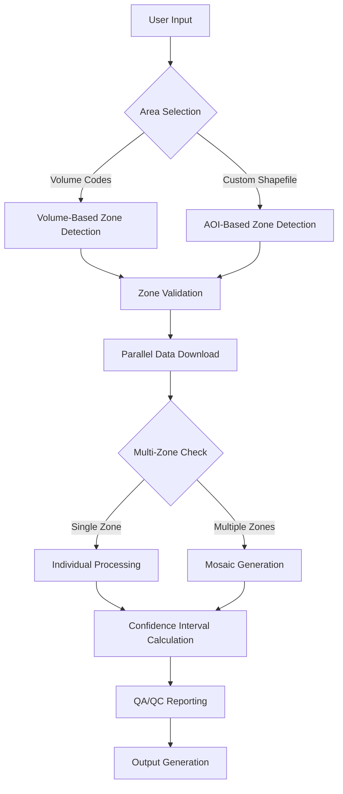
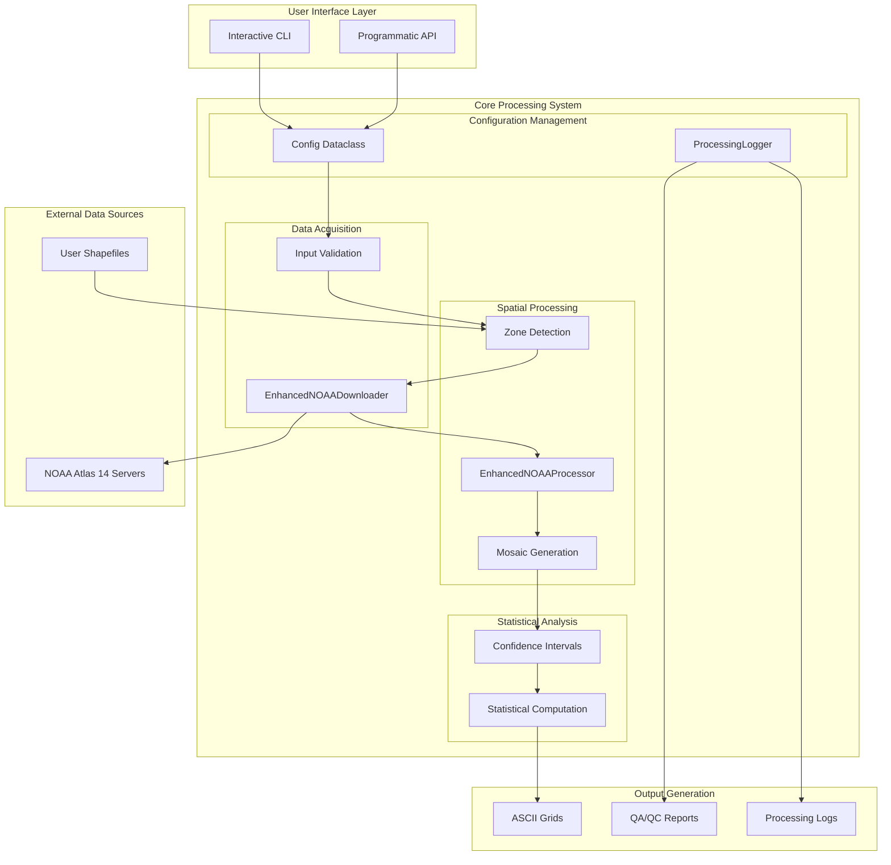
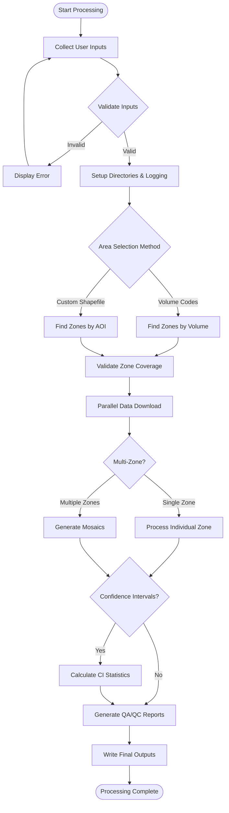
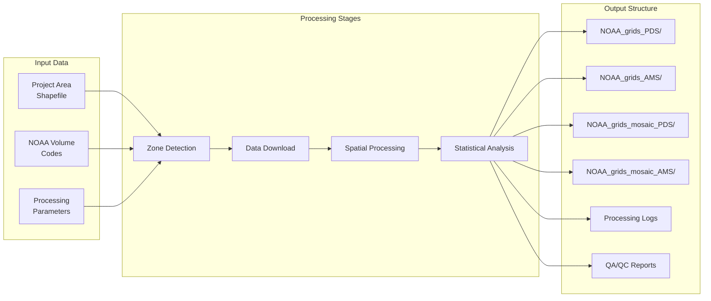

# NOAA Atlas 14 Grid Processor

[](https://www.python.org/downloads/)
[](LICENSE)
[](https://hdsc.nws.noaa.gov/hdsc/pfds/)

A comprehensive Python tool for automated downloading, processing, and analysis of NOAA Atlas 14 precipitation frequency grids. This enhanced version supports both Partial Duration Series (PDS) and Annual Maximum Series (AMS) data, volume-based selection, confidence interval calculations, and advanced mosaicking capabilities.

## Table of Contents
- [Overview](#overview)
- [Features](#features)
- [Quick Start](#quick-start)
- [Requirements](#requirements)
- [Installation](#installation)
- [Usage Workflow](#usage-workflow)
- [Input/Output](#inputoutput)
- [Configuration](#configuration)
- [NOAA Atlas 14 Volumes](#noaa-atlas-14-volumes)
- [Architecture](#architecture)
- [Troubleshooting](#troubleshooting)
- [Contributing](#contributing)
- [License](#license)
- [Appendix: Visual Documentation](#appendix-visual-documentation)

## Overview

The NOAA Atlas 14 Grid Processor automates the complex process of acquiring, processing, and analyzing precipitation frequency data from NOAA's Atlas 14 database. It supports both area-of-interest (AOI) based processing using custom shapefiles and volume-based selection using predefined NOAA Atlas 14 regions. The tool handles multiple precipitation duration series types, performs advanced statistical calculations, and generates comprehensive mosaicked outputs suitable for hydrological and meteorological analysis.

## Features

- **Dual Data Series Support**: Process both Partial Duration Series (PDS) and Annual Maximum Series (AMS) data
- **Flexible Area Selection**: Choose data by custom shapefile boundaries or predefined NOAA Atlas 14 volumes
- **Automated Multi-Zone Processing**: Seamlessly handle data spanning multiple NOAA zones with intelligent mosaicking
- **Confidence Interval Analysis**: Calculate 90% confidence intervals with 1% plus/minus statistics for 100-year events
- **Comprehensive Quality Assurance**: Built-in validation, detailed logging, and QA/QC reporting with processing statistics
- **Parallel Processing**: Multi-threaded downloads and processing for optimal performance
- **Interactive Configuration**: User-friendly command-line interface with validation and error handling
- **Resume Capability**: Skip processing for already-available data files to save time

## Quick Start

For immediate processing with default settings:

```python
# Basic usage example
from pathlib import Path
from NOAA_GridMiner import EnhancedNOAAGrids

# Initialize processor
processor = EnhancedNOAAGrids()

# Process grids for specific volumes (e.g., Southeastern States)
processor.process_grids(
    base_dir="./NOAA_Data",
    volume_codes=['se'],  # Southeastern States (Volume 9)
    states_shp_path="./US_States/tl_2021_us_state.shp",
    event_list=['10', '25', '100'],  # 10, 25, 100-year events
    dur_list=['30m', '60m', '24h'],  # 30-min, 1-hour, 24-hour durations
    series_types=['PDS'],
    CI_100yr=True
)
```

For interactive mode, simply run:
```bash
python NOAA_GridMiner.py
```

## Requirements

- **Python**: 3.8 or higher
- **System Requirements**:
  - RAM: 8GB minimum (16GB+ recommended for large areas)
  - Disk space: 1-10GB depending on selected area and parameters
  - Internet connection for NOAA data downloads

- **Required Python Packages**:
  ```
  geopandas>=0.10.0
  rasterio>=1.3.0
  requests>=2.25.0
  numpy>=1.20.0
  scipy>=1.7.0
  tqdm>=4.60.0
  pathlib>=1.0.0
  ```

- **Optional Dependencies**:
  ```
  matplotlib>=3.3.0  # For visualization
  jupyter>=1.0.0     # For notebook usage
  ```

## Installation

### Standard Installation

1. **Clone the repository**:
   ```bash
   git clone https://github.com/username/noaa-atlas14-processor.git
   cd noaa-atlas14-processor
   ```

2. **Install dependencies**:
   ```bash
   pip install -r requirements.txt
   ```

3. **Verify installation**:
   ```bash
   python -c "import geopandas, rasterio; print('Installation successful')"
   ```

### Development Installation

```bash
git clone https://github.com/username/noaa-atlas14-processor.git
cd noaa-atlas14-processor
pip install -e .
pip install -r requirements-dev.txt
```

### Using Conda

```bash
conda create -n noaa-processor python=3.9
conda activate noaa-processor
conda install -c conda-forge geopandas rasterio requests numpy scipy tqdm
```

## Usage Workflow

### Complete Processing Workflow

The NOAA Grid Processor follows a comprehensive 8-step workflow for data acquisition and processing:

#### Phase 1: Configuration and Setup

**Step 1: Define Base Directory**
```python
# Specify where all output data will be stored
base_dir = Path("D:/Projects/NOAA/Precipitation")
base_dir.mkdir(parents=True, exist_ok=True)
```

**Step 2: Choose Area Definition Method**

*Option A: Volume-Based Selection*
```python
# Use predefined NOAA Atlas 14 volumes
volume_codes = ['se', 'ne']  # Southeastern and Northeastern states
prj_area_shp_path = None
```

*Option B: Custom Area of Interest*
```python
# Use custom shapefile boundary
prj_area_shp_path = "path/to/project_area.shp"
volume_codes = None
```

**Step 3: Configure Processing Parameters**
```python
config = {
    'series_types': ['PDS'],  # or ['AMS'] or ['BOTH']
    'event_list': ['1', '2', '5', '10', '25', '50', '100'],
    'dur_list': ['05m', '10m', '15m', '30m', '60m', '02h', '24h'],
    'CI_100yr': True  # Calculate confidence intervals
}
```

#### Phase 2: Data Acquisition

**Step 4: Zone Detection and Validation**
The system automatically identifies required NOAA zones based on your area selection and validates data availability.

**Step 5: Parallel Data Download**
```python
# Downloads are handled automatically with progress tracking
# Files are downloaded in parallel with retry logic and validation
```

#### Phase 3: Processing and Analysis

**Step 6: Multi-Zone Mosaicking** (if applicable)
When data spans multiple zones, the system automatically creates seamless mosaics using maximum value compositing.

**Step 7: Confidence Interval Calculation** (if enabled)
For 100-year events, the system calculates 90% confidence intervals and generates plus/minus grids.

**Step 8: Quality Assurance and Reporting**
Comprehensive QA/QC reports are generated with processing statistics, data sources, and validation results.

### Interactive Mode Usage

Run the script in interactive mode for guided processing:

```bash
python NOAA_GridMiner.py
```

Follow the prompts for each configuration step:

1. **Base Directory**: Specify output location
2. **AOI Method**: Choose volume selection or custom shapefile
3. **NOAA Zones**: Use built-in or custom zones shapefile
4. **Series Type**: Select PDS, AMS, or both
5. **Events**: Choose recurrence intervals (1-1000 years)
6. **Durations**: Select precipitation durations (5min-24hr)
7. **Confidence Intervals**: Enable/disable for 100-year events
8. **Processing Options**: Configure logging and statistics

### Programmatic Usage

```python
from NOAA_GridMiner import EnhancedNOAAGrids

# Initialize with custom configuration
processor = EnhancedNOAAGrids()

# Process specific regions
processor.process_grids(
    base_dir="./output",
    volume_codes=['tx', 'se'],  # Texas and Southeast
    states_shp_path="./US_States/tl_2021_us_state.shp",
    event_list=['25', '50', '100'],
    dur_list=['60m', '02h', '06h', '24h'],
    series_types=['BOTH'],  # Process both PDS and AMS
    CI_100yr=True
)
```

## Input/Output

### Input Requirements

| Input Type | Format | Required Fields | Notes |
|------------|--------|-----------------|-------|
| Project Area Shapefile | .shp (with .shx, .dbf, .prj) | Geometry column | Must be in geographic coordinates |
| NOAA Zones Shapefile | .shp (with .shx, .dbf, .prj) | NOAA14_cd field | Built-in version available |
| Volume Codes | List of strings | Valid volume codes/numbers | See NOAA Atlas 14 Volumes section |

### Output Specifications

| Output Type | Format | Contents | Location |
|-------------|--------|----------|----------|
| Individual Grids | ASCII (.asc) | Zone-specific precipitation grids | `NOAA_grids_{series}/` |
| Mosaicked Grids | ASCII (.asc) | Combined multi-zone grids | `NOAA_grids_mosaic_{series}/` |
| Confidence Intervals | ASCII (.asc) | Plus/minus grids for 100-yr events | Same as mosaicked grids |
| Processing Log | Text (.log) | Detailed operation history | Base directory |
| QA/QC Report | Text (.txt) | Summary statistics and validation | `noaa_processing.txt` |

### Output File Naming Convention

**PDS Files:**
- Main grids: `{zone}{event}yr{duration}a.asc` (e.g., `se25yr24ha.asc`)
- Confidence intervals: `{zone}{event}yr{duration}a{u/l}.asc`
- Mosaics: `comb{event}yr{duration}a.asc`

**AMS Files:**
- Main grids: `{zone}{event}yr{duration}a_ams.asc` (e.g., `se25yr24ha_ams.asc`)
- Confidence intervals: `{zone}{event}yr{duration}a{u/l}_ams.asc`
- Mosaics: `comb{event}yr{duration}a_ams.asc`

## Configuration

### Core Configuration Parameters

| Parameter | Description | Default | Required | Type |
|-----------|-------------|---------|----------|------|
| base_dir | Output directory path | None | Yes | str/Path |
| prj_area_shp_path | Custom area shapefile path | None | Conditional | str/Path |
| volume_codes | NOAA Atlas 14 volume codes | None | Conditional | List[str] |
| states_shp_path | NOAA zones shapefile path | Built-in | Yes | str/Path |
| series_types | Duration series types | ['PDS'] | Yes | List[str] |
| event_list | Recurrence intervals (years) | ['100'] | Yes | List[str] |
| dur_list | Precipitation durations | ['24h'] | Yes | List[str] |
| CI_100yr | Calculate confidence intervals | True | No | bool |

### Advanced Configuration

```python
from NOAA_GridMiner import Config

# Customize download behavior
config = Config()
config.CHUNK_SIZE = 2048 * 1024  # 2MB chunks
config.MAX_RETRIES = 5
config.TIMEOUT = 60

# Initialize with custom config
processor = EnhancedNOAAGrids(config=config)
```

### Environment Variables

```bash
# Optional: Set download directory
export NOAA_DOWNLOAD_DIR=/path/to/downloads

# Optional: Set number of parallel downloads
export NOAA_MAX_WORKERS=8
```

## NOAA Atlas 14 Volumes

The tool supports all 12 published NOAA Atlas 14 volumes:

| Volume | Code | Name | Coverage Area |
|--------|------|------|---------------|
| 1 | sw1 | Semiarid Southwest | Arizona, Nevada, Utah |
| 2 | orb | Ohio River Basin | Indiana, Kentucky, Ohio, Tennessee, West Virginia |
| 3 | pr | Puerto Rico | Puerto Rico, U.S. Virgin Islands |
| 4 | hi | Hawaiian Islands | Hawaii |
| 6 | sw6 | California | California |
| 7 | ak | Alaska | Alaska |
| 8 | mw | Midwestern States | Illinois, Iowa, Michigan, Minnesota, Missouri, Wisconsin |
| 9 | se | Southeastern States | Alabama, Florida, Georgia, Mississippi, South Carolina |
| 10 | ne | Northeastern States | Connecticut, Maine, Massachusetts, New Hampshire, Rhode Island, Vermont |
| 11 | tx | Texas | Texas |
| 12 | inw | Interior Northwest | Idaho, Montana, Oregon, Washington |

### Volume Selection Examples

```python
# Single volume by code
volume_codes = ['se']

# Multiple volumes by code
volume_codes = ['se', 'ne', 'mw']

# Volume by number
volume_codes = ['9']  # Southeastern States

# Mixed codes and numbers
volume_codes = ['se', '10', 'tx']
```

## Architecture

### Component Overview

The system follows a modular architecture with clear separation of concerns:

- **Config**: Centralized configuration management and validation
- **ProcessingLogger**: Comprehensive logging and QA/QC reporting
- **EnhancedNOAADownloader**: Parallel download management with retry logic
- **EnhancedNOAAProcessor**: Core spatial processing and analysis algorithms
- **EnhancedNOAAGrids**: Main orchestration class coordinating all operations

### Key Processing Components

**Data Acquisition Module**
- Validates NOAA zone coverage and file availability
- Manages parallel downloads with progress tracking
- Implements retry logic and error recovery
- Supports both PDS and AMS series types

**Spatial Processing Engine**
- Performs geometric intersection analysis for zone detection
- Creates seamless mosaics using maximum value compositing
- Handles coordinate reference system transformations
- Applies advanced raster processing algorithms

**Statistical Analysis Module**
- Computes 90% confidence intervals using log-normal distribution
- Calculates 1% plus/minus statistics for risk assessment
- Generates comprehensive statistical summaries
- Validates statistical assumptions and data quality

**Quality Assurance Framework**
- Tracks all operations with detailed timestamps
- Validates input data integrity and completeness
- Generates comprehensive QA/QC reports
- Provides processing statistics and performance metrics

### Data Flow Architecture



## Troubleshooting

### Common Issues

| Issue | Possible Cause | Solution |
|-------|----------------|----------|
| Download failures | Network connectivity, NOAA server issues | Check internet connection, retry with fewer parallel downloads |
| Shapefile reading errors | Invalid file format, missing projection | Ensure .shp file has all components (.shx, .dbf, .prj) and valid CRS |
| Memory errors during mosaicking | Large datasets, insufficient RAM | Process smaller areas, increase system memory, or use 64-bit Python |
| ASCII file format errors | Corrupted downloads | Delete partial files and re-run processing |
| Zone detection failures | Shapefile CRS mismatch | Ensure shapefiles are in geographic coordinates (EPSG:4326 or similar) |

### Error Messages and Solutions

| Error Message | Meaning | Resolution |
|---------------|---------|------------|
| "Invalid volume codes" | Unknown volume code provided | Use valid codes from NOAA Atlas 14 Volumes table |
| "No intersecting zones found" | Project area doesn't overlap NOAA zones | Check shapefile geometry and CRS |
| "Failed to download after X attempts" | Persistent download failure | Check NOAA server status, try again later |
| "Pattern validation failed" | Unexpected file naming in downloads | Report issue with specific file names |
| "Confidence interval computation failed" | Missing upper/lower bound files | Ensure CI files downloaded correctly |

### Diagnostic Tools

**Enable Debug Logging**
```python
import logging
logging.basicConfig(level=logging.DEBUG)

# Run processing with detailed logging
processor.process_grids(..., verbose=True)
```

**Check File Availability**
```python
from NOAA_GridMiner import validate_ascii_availability

status = validate_ascii_availability(
    base_dir, zones, events, durations, series_types
)
print("File availability:", status)
```

**Manual Zone Detection**
```python
from NOAA_GridMiner import EnhancedNOAAProcessor

processor = EnhancedNOAAProcessor()
zones = processor.find_noaa_zones_by_aoi(
    "project_area.shp", "noaa_zones.shp"
)
print("Detected zones:", zones)
```

### Performance Optimization

1. **Reduce Parallel Downloads**: If experiencing network issues, reduce concurrent downloads
2. **Use SSD Storage**: Store outputs on SSD for faster I/O operations
3. **Increase Memory**: 16GB+ RAM recommended for large multi-zone processing
4. **Regional Processing**: Process large areas in smaller regional chunks

## Contributing

We welcome contributions to improve the NOAA Atlas 14 Grid Processor! Please follow these guidelines:

### Development Setup

1. Fork the repository
2. Create a development environment:
   ```bash
   conda create -n noaa-dev python=3.9
   conda activate noaa-dev
   pip install -r requirements-dev.txt
   ```
3. Create a feature branch: `git checkout -b feature/amazing-feature`
4. Make your changes with appropriate tests
5. Run the test suite: `pytest tests/`
6. Commit changes: `git commit -m 'Add amazing feature'`
7. Push to branch: `git push origin feature/amazing-feature`
8. Open a Pull Request

### Code Standards

- Follow PEP 8 style guidelines
- Include docstrings for all functions and classes
- Add unit tests for new functionality
- Update documentation for user-facing changes
- Ensure backward compatibility when possible

### Testing

```bash
# Run full test suite
pytest tests/

# Run specific test categories
pytest tests/test_downloads.py  # Download functionality
pytest tests/test_processing.py  # Processing algorithms
pytest tests/test_validation.py  # Input validation
```

## License

This project is licensed under the MIT License - see the [LICENSE](LICENSE) file for details.

---

## Appendix: Visual Documentation

### System Architecture Diagram



### Processing Workflow Diagram



### Data Flow and File Structure



For additional support or questions, please visit our [documentation wiki](https://github.com/username/noaa-atlas14-processor/wiki) or open an issue on GitHub.